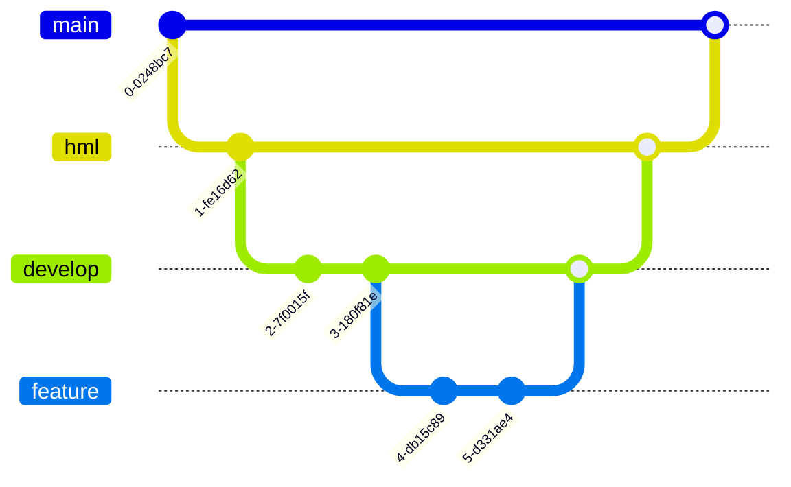

# POC Microserviço PAG AI

Esse repositório tem a finalidade de definir os padrões utilizados para desenvolver microsserviços em Go na Pag.aí

### Dependencias do projeto
 - [Taskfile](https://taskfile.dev/)
 - [Go-migrate](https://github.com/golang-migrate/migrate)
 - [gomock](https://github.com/golang/mock)

GIT FLOW

### Diretórios

 - cmd: entrypoint do microserviço [http, grpc, cli...]
 - internal: regras de negócio
    - domain: definição do domínio
      - entities: structs que definem as entidades do domínio
      - repository: interfaces de conexão com o banco e suas implementações
      - services: interfaces de serviço seguidas de suas implementações
      - handlers: implementação de handlers servidos no diretório cmd
 - pkg: utilitários e ferramentas externas
    - database: definição da interface do banco e implementações
    - utils: código de uso generalizado
    - queue: ferramenta de mensageria/fila
    - ...

### Diretrizes

- toda funcionalidade deve ser exposta através de uma interface
- se um package quiser ter uma dependência de outro package esse deve depender da interface exposta e nunca 
  diretamente do outro pacote
- os subpackages do pkg só podem importar o pkg/
- package main é o responsável por fazer a injeção de dependência e é o único que pode importar todos os outros packages
